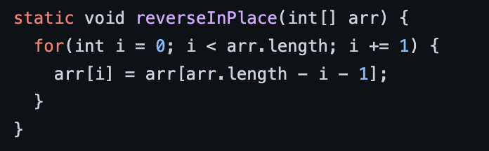
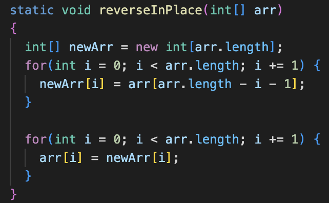

# Week 1 Lab Report
# 1. Part 1
```
import java.io.IOException;
import java.net.URI;
import java.util.ArrayList;

class Handler implements URLHandler
{
    String list = "";
    ArrayList<String> listOfWords = new ArrayList<String>();
    public String handleRequest(URI url) 
    {
        if (url.getPath().equals("/")) 
        {
            return "main page";
        }
        else if (url.getPath().equals("/p"))
        {
            for (int i = 0; i < listOfWords.size(); i++)
            {
                list = list + " " + listOfWords.get(i);
            }
            return String.format(list);
        }
        else 
        {
            System.out.println("Path: " + url.getPath());
            if (url.getPath().contains("/add")) 
            {
                String[] parameters = url.getQuery().split("=");
                if (parameters[0].equals("s")) 
                {
                    listOfWords.add(parameters[1]);
                    return "added";
                }
            }
            return "404 Not Found!";
        }
    }
}

class SearchEngine {
    public static void main(String[] args) throws IOException 
    {
        if(args.length == 0){
            System.out.println("Missing port number! Try any number between 1024 to 49151");
            return;
        }

        int port = Integer.parseInt(args[0]);

        Server.start(port, new Handler());
    }
}
```
## String handleRequest(URI url)
The first part of this method opens the main page when access. The program checks if the url has a "/" which open the main page. The user would see a web page letting them know that they are on the main page. 


The else statement searches the url for the path "/add" and the query "?s=" which tells the program to add a word to the array list. Whenever the user were to use this, they would get a message letting them know that their word has been added to the array list.


The else if statement checks if the url has the path "/p", which returns the added elements to the array list. The user will see a webpage with all the words they added. 


# 2. Part 2
## 1. `reverseInPlace(int[] arr)` 
* **Failure Inducing Input:** [1,2,3]
* **Symptom/Output:** [3,2,3]  
* **Bug:** The bug was that the for loop was modifying that array only which meant that the first element was no longer 1, but now three. We had to make a new array where we would copy the elements into that array so that the original array would not be modified. 

Original             |  New
:-------------------------:|:-------------------------:
  |  

## 2. `reversed` 
* **Failure Inducing Input:** [1,2,3]
* **Symptom/Output:** [0,0,0] 
* **Bug:** The bug in this method was that the for loop was modifying the wrong array. It was reversing the array with values all initialized to zero. We just swapped the arrays and the method works fine now. 
