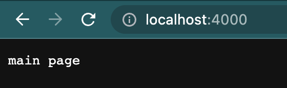
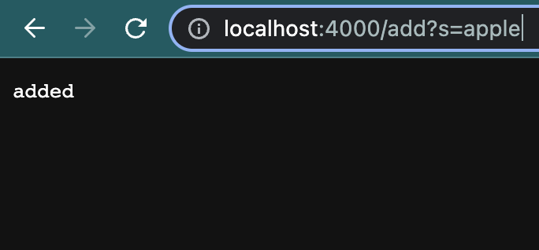
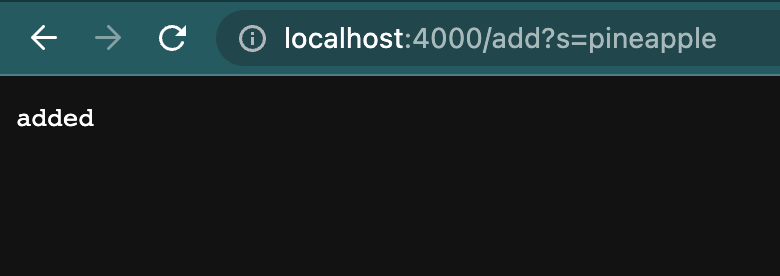
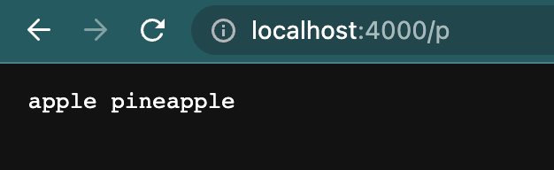

# Week 1 Lab Report
## 1. Part 1
```
import java.io.IOException;
import java.net.URI;
import java.util.ArrayList;

class Handler implements URLHandler
{
    String list = "";
    ArrayList<String> listOfWords = new ArrayList<String>();
    public String handleRequest(URI url) 
    {
        if (url.getPath().equals("/")) 
        {
            return "main page";
        }
        else if (url.getPath().equals("/p"))
        {
            for (int i = 0; i < listOfWords.size(); i++)
            {
                list = list + " " + listOfWords.get(i);
            }
            return String.format(list);
        }
        else 
        {
            System.out.println("Path: " + url.getPath());
            if (url.getPath().contains("/add")) 
            {
                String[] parameters = url.getQuery().split("=");
                if (parameters[0].equals("s")) 
                {
                    listOfWords.add(parameters[1]);
                    return "added";
                }
            }
            return "404 Not Found!";
        }
    }
}

class SearchEngine {
    public static void main(String[] args) throws IOException 
    {
        if(args.length == 0){
            System.out.println("Missing port number! Try any number between 1024 to 49151");
            return;
        }

        int port = Integer.parseInt(args[0]);

        Server.start(port, new Handler());
    }
}
```
1) The first method in the handler class calls for for the main page. When accessing the search engine, the user will first see this page. This is the home page and has no path or query.




2) The second method in the handler class looks for the path named "p". When this happens, it would return all the words that were added to the array list.





3) The third method in the handler class is where the user would add the words to the array list. With the pass "add" and the query "s=", the word after the "=" is what is being added to the array list. Whenever the user were to use this, they would get a message letting them know that their word has been added to the array list. 




## 2. Part 2
In the array methods there were many bugs. The ReverseInPlace method had a bug. When we inputed the array [1,2,3], The modified array would be [3,2,3] instead of [3,2,1]. This was the symptom. The bug was that the for loop was modifying that array only which meant that the first element was no longer 1, but now three. We had to make a new array where we would copy the elements into that array so that the original array would not be modified. 

Also in that array class, the reversed method had a bug. When we inputed the array [1,2,3], it would return [0,0,0], instead of [3,2,1]. The bug in this method was that the for loop was modifying the wrong array. It was reversing the array with values all initialized to zero. We just swapped the arrays and the method works fine now. 
